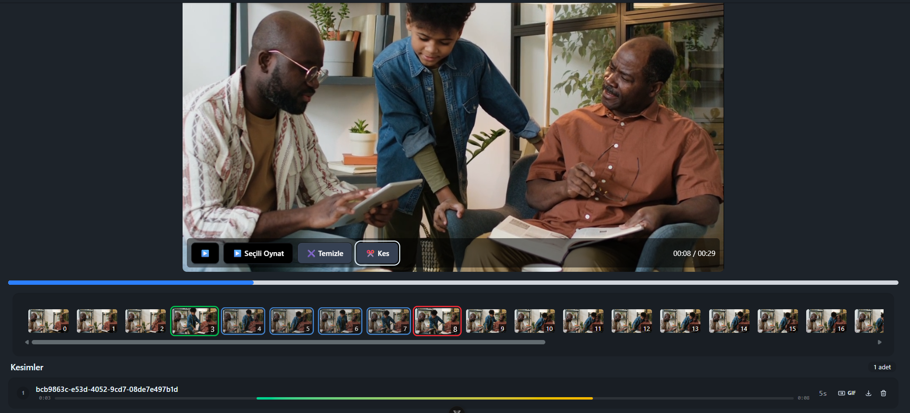
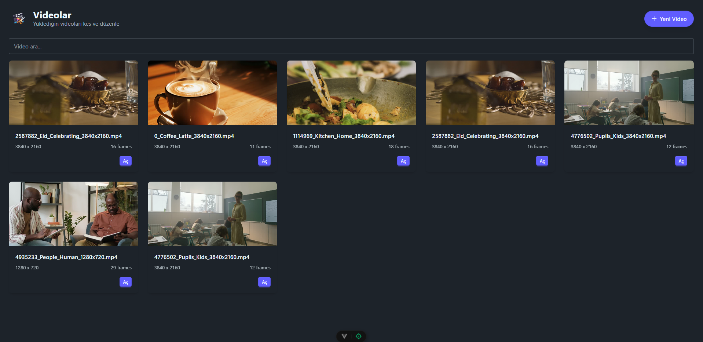
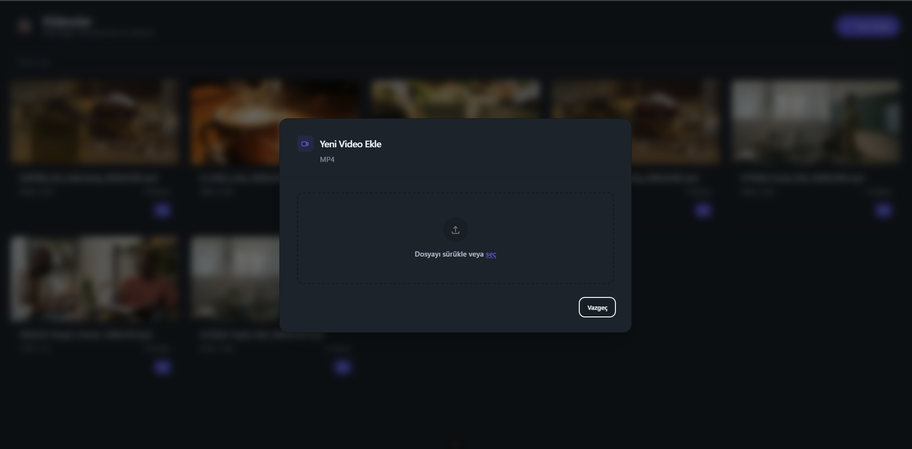
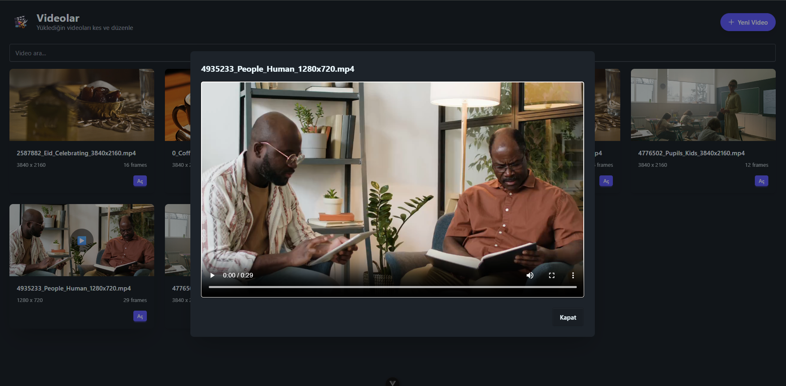
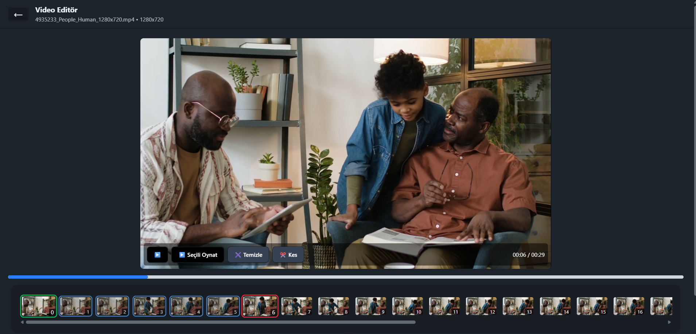

# ClipForge - Video Kesme ve Düzenleme Uygulaması



<table>
  <tr> 
    <td></td> 
    <td></td>
    <td></td> 
    <td></td> 
    <td></td>
  </tr> 
</table>

## Projenin Amacı
ClipForge, kullanıcıların local sistemlerinde video kesme, düzenleme ve GIF gibi formatlara dönüştürme işlemleri yapmalarını sağlayan bir uygulamadır.

- **Frontend:** Vue.js  
- **Backend:** .NET  
- **Video İşleme:** FFmpeg  

FFmpeg, video ve ses dosyaları üzerinde güçlü işlemler gerçekleştirebilen açık kaynaklı bir multimedya çerçevesidir. Bu proje ile, .NET arayüzü üzerinden FFmpeg kullanılarak video işlemleri yapılmakta ve kullanıcıya arka planda işlemler sunulmaktadır.

### Benim Katkılarım
- Video işlemleri sırasında **thumbnail oluşturma** ve arka plan görevlerini yönetmek,  
- Kullanıcının başka işlemlerle uğraşmasını engellemeden arka planda işlemlerin tamamlanmasını sağlamak.


## Özellikler ve Teknik Detaylar
- **Büyük dosya desteği:**  
  Video ve resimler büyük boyutlarda olabilir; bu nedenle bazı işlemler **parça parça indirme** veya **kareleri tek bir resimde birleştirme** şeklinde yapılır.  
- **Önizleme:**  
  İşlem sonrası frontend'de kareler saniye bazında parçalanarak kullanıcıya gösterilir. Bu sayede videonun hangi bölümlerinin nasıl göründüğü rahatlıkla takip edilebilir.

## Kurulum ve Kullanım
1. Repoyu klonlayın:  
   ```bash
   git clone https://github.com/kullaniciAdi/ClipForge.git
